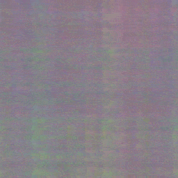

# `autodiff`

My implementation of an autodiff library that supports scalar, vector and matrix data types. Everything was done from scratch. The `examples` folder shows how to use it for some cases, including the implementation of a NeRF model that is able to learn an image. This project was made just for fun.

| Reference image | Learning process | Final learned image
| --- | --- | --- |
|  |  | 

<details>
<summary>Code</summary>

The full example is available at [`examples/nerf.cpp`](https://github.com/diegoroyo/autodiff/blob/master/examples/nerf.cpp). The code implements a NeRF with positional encoding and 4 layers total.

### Model

```c++
ad::Vector<3>& forward(ad::Vector<2>& xy) {
    ad::Vector<32>& input = ad::nn::positional_encoding<8>(xy);

    ad::Vector<128>& l1 = ad::relu(w1 * input + b1);
    ad::Vector<128>& l2 = ad::relu(w2 * l1 + b2);
    ad::Vector<128>& l3 = ad::relu(w3 * l2 + b3);
    ad::Vector<3>& output = ad::sigmoid(w4 * l3 + b4);

    return output;
}
```

The training chooses random pixels from an image and uses that as a loss so the network learns how to reproduce it.

### Training

```c++
common::Bitmap3f image = common::load_bitmap<common::Color3f>(
    "sunflower.ppm");
auto [width, height] = y.size();

for (size_t step = 0; step < steps; ++step) {
    unsigned int px = rand() % width;
    unsigned int py = rand() % height;

    ad::Vector<2> xy({(float)px / width, (float)py / height});
    common::Vec3f y_i = y(px, py);

    auto& y_est = nerf.forward(xy);
    auto& loss = ad::pow(y_est - y_i, 2);
    loss.backward();
    nerf.update(lr);
}
```
</details>

## Implemented functions

### `autodiff/autodiff.h`

#### Base types
* `ad::Value` for scalar values
* `ad::Vector<N>` for vectors of size `N`
* `ad::Matrix<N, M>` for matrices of `N` rows and `M` columns

#### Basic operators
* `+`, `-`, `/`
* `*`: Either (1) at least one of the operands is a scalar (2) both are vectors, which results in element-wise multiplcation or (3) matrix-matrix/matrix-vector multiplication.

#### Extended operators
* `ad::pow`, `ad::sin`, `ad::cos`, `ad::relu`, `ad::sigmoid`: Those apply such functions in an element-wise manner if the input is a vector/matrix.
* `ad::sum`: Reduces input to a scalar.
* `ad::expand<N>`: Works for scalar and vector data. Repeats it N times and returns this in a vector.

### `autodiff/nn.h`

* `ad::nn::positional_encoding<N>(T& x)`: Converts `x` to `{sin(x), cos(x),  ... , sin(x*2^(N-1)), cos(x*2^(N-1))}`. Accepts scalar or vector values. In the case of a vector with M values, the result is `{sin(x_0), ... , sin(x_M), cos(x_0), ..., cos(x_M), ... }`.