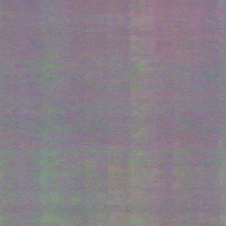

# `autodiff`

My implementation of an autodiff library that supports scalar and tensor-like (vector, matrix, and higher dimension) data types. Everything was done from scratch. The `examples` folder shows how to use it for some cases, including the implementation of a [NeRF model that is able to learn an image](https://github.com/diegoroyo/autodiff/blob/master/examples/nerf.cpp), and a [LeNet-5 network that can classify MNIST digits with 95% accuracy](https://github.com/diegoroyo/autodiff/blob/master/examples/lenet.cpp). This project was made just for fun.

| Reference image | Learning process | Final learned image
| --- | --- | --- |
|  |  | 

There are many examples at the [`examples`](https://github.com/diegoroyo/autodiff/blob/master/examples/) folder. You can check below some snippets for [`examples/nerf.cpp`](https://github.com/diegoroyo/autodiff/blob/master/examples/nerf.cpp) which implements a NeRF with positional encoding and 4 layers total.

<details>
<summary>Code walkthrough</summary>

### Model

```c++
#include "autodiff/autodiff.h"

ad::Vector<3> forward(ad::Vector<2>& xy) {
    ad::Vector<32> input = ad::nn::positional_encoding<8>(xy);

    ad::Vector<128> l1 = ad::relu(w1 * input + b1);
    ad::Vector<128> l2 = ad::relu(w2 * l1 + b2);
    ad::Vector<128> l3 = ad::relu(w3 * l2 + b3);
    ad::Vector<3> output = ad::sigmoid(w4 * l3 + b4);

    return output;
}
```

The training chooses random pixels from an image and uses that as a loss so the network learns how to reproduce it.

### Training

```c++
#include "autodiff/autodiff.h"

common::Bitmap3f image = common::load_bitmap<common::Color3f>(
    "sunflower.ppm");
auto [width, height] = y.size();

for (size_t step = 0; step < steps; ++step) {
    unsigned int px = rand() % width;
    unsigned int py = rand() % height;

    ad::Vector<2> xy({(float)px / width, (float)py / height});
    common::Tensor<float, 3> y_i = y(px, py);

    auto y_est = nerf.forward(xy);
    auto loss = ad::pow(y_est - y_i, 2);
    loss.backward();
    nerf.update(lr);
}
```
</details>

## Usage

You only need to include `autodiff.h`:

```c++
#include "autodiff/autodiff.h"
```

The available classes and functions are listed below.

### `autodiff/value.h`

#### Base types
* `ad::Value` for scalar values (uses `float`)
* `ad::Vector<N>` for vectors of size `N` (uses `common::Tensor<float, N>`)
* `ad::Matrix<N, M>` for matrices of `N` rows and `M` columns (uses `common::Tensor<float, N, M>`)
* `ad::Tensor<Shape...>` for general tensor data (uses `common::Tensor<float, Shape...>`)

Each of these forms a node that computes `y = f(x)`. Each node has the following methods:
* `value()`: Returns `f(x)`
* `backward()`: Computes the derivatives of all children nodes in the graph (see `grad()`).
* `grad()`: Returns `dy/dx`, where `y` is the variable you called `backward()` on, and `x` is the current node.
* `requires_grad()`: Whether derivatives will be computed on its when `backward()` is called.
* `set_requires_grad(bool requires_grad)`: Sets the `requires_grad` attribute.
* `update(float lr)`: Short for `value() -= grad() * lr`

#### Basic operators
* `+`, `-`, `/`
* `*`: Either (1) at least one of the operands is a scalar (2) both are vectors, which results in element-wise multiplcation or (3) matrix-matrix/matrix-vector multiplication.

#### Extended operators
Those apply such functions in an element-wise manner if the input is a vector/matrix/tensor.
* Exponential functions: `ad::pow`, `ad::log`, `ad::exp`.
* Trigonometric functions: `ad::sin`, `ad::cos`.
* Activation functions: `ad::relu`, `ad::sigmoid`. 
* `ad::sum`: Reduces input to a scalar.
* `ad::expand<N>`: Works for scalar and vector data. Repeats it N times and returns this in a vector.
* `ad::flatten`: Converts a `Tensor` to a flattened `Vector`

### `autodiff/nn.h`

* `ad::nn::positional_encoding<N>(T& x)`: Converts `x` to `{sin(x), cos(x),  ... , sin(x*2^(N-1)), cos(x*2^(N-1))}`. Accepts scalar or vector values. In the case of a vector with M values, the result is `{sin(x_0), ... , sin(x_M), cos(x_0), ..., cos(x_M), ... }`.
* `ad::nn::softmax(Vector<N>& x)`: Converts `x` to a probability distribution of `N` possible outcomes.
* `ad::nn::cross_entropy(Vector<N>& logits, Vector<N>& target)`: Computes the cross entropy loss.
* `ad::nn::conv_2d(Tensor<C_IN, H, W>& input, Tensor<C_OUT, C_IN, K, K>& kernel, Tensor<C_OUT>& bias)`: Applies a convolution (with stride 1, adding the necessary zero padding).
* `ad::nn::avg_pool_2d<N>`: Does average pooling with stride `N` and adding the necessary zero padding (like `ceil_mode=True` in PyTorch).